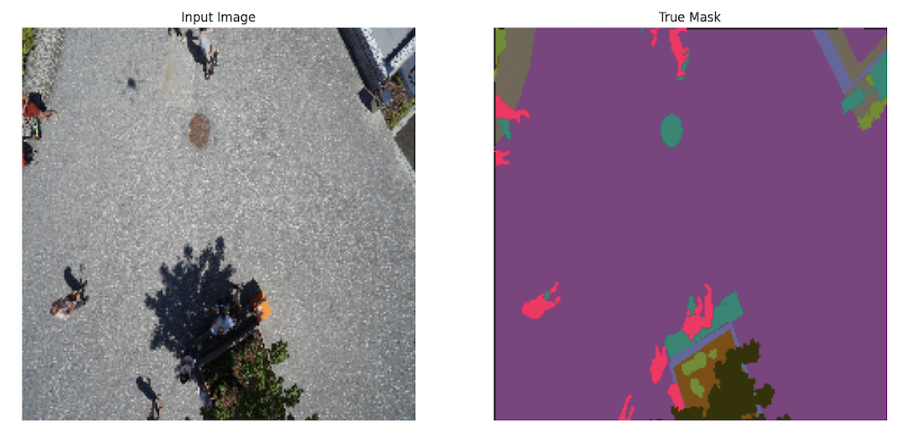
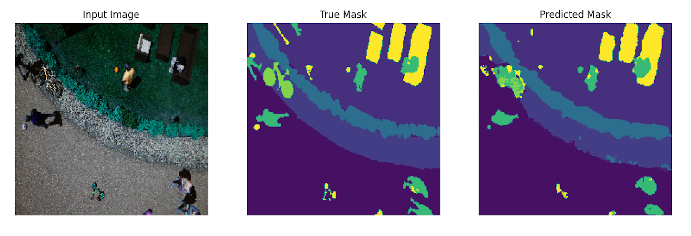
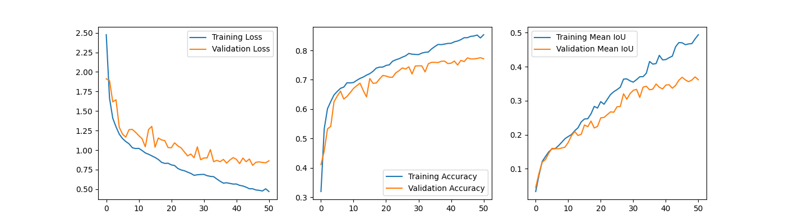
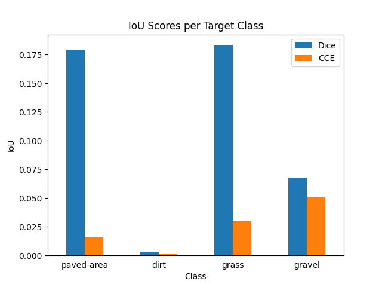

### Contents:
- [Problem Stament](#Background)
- [File Structure](#Data-Import-and-Cleaning)
- [Semantic Segmentation Data](#Semantic-Segmentation-Data)
- [U-Net Model](#U-Net-Model)
- [Model Analysis](#Model-Analysis)
- [Conclusion](#Conclusion)

# Software Requirements
These python packages are required to run notebooks and scripts:
- Numpy
- Pandas
- Tensorflow
- Matplotlib
- OpenCV
- Albumentations

# Problem Statement

One of the highest costs in package delivery is refered to as 'last-mile delivery'. This referes to the local package delivery once a product has arrived at a distribution center. To address this need, a new start-up plans to use drone delivery for packages. 

As a data scientist for this start-up, I have been tasked with helping to create the model that will determine the zones were the drone can descend and unload the packages. 

I will be using the drone image dataset from the Institute of Computer Graphics and Vision ([source](https://www.tugraz.at/index.php?id=22387)) to train a model on image semantic segmentation. This will allow the drone to distinquish which surfaces to land on through its cameras. In the evaluation of the model, I will focus on its score for the following surfaces:
- Paved Area
- Gravel
- Dirt
- Grass


# File Structure

```
├── presentation.pdf
├── README.md
├── module                                          # Contains scripts to use custom functions
├── notebooks                                       # Contains notebooks for modeling workflow
    ├──EDA.ipynb
    ├──Modeling.ipynb
    └──Analysis.ipynb
├── imgs                                            # Collection of visualizations from modeling
└── semantic_drone_dataset                          # Includes original and processed images and masks
```

Within the `semantic_drone_dataset` folder, I have only processed folder in this repo that is produced after the EDA notebook. If wanting to run the EDA notebook, one must download the original dataset from the image dataset. 

# Semantic Segmentation Data

For this task, I will be creating a Semantic Segmentation model. The basics of this type of model is that it can classfiy each pixel to a given class and create a mask that corresponds to the class value. An example of an image pair can be shown below. 



In this graphic, the mask is given in RGB. During the data exploration and processing in this repo, the masks were converted to class value pixel with only 1 channel. The original images are given in 4000 x 6000 but this would be resized in preprocessing to 224 by 224. 



This is an example of the predicted mask from the model with the class value pixels.

# U-Net Model

One of the model architectures used for segmentation is the U-Net model. The main parts of the model are an encoder (or downsampling) and a decoder (or upsampling). The encoder portion includes Convolutional layers with downsampling using strides > 1 and skip layers to upsampled Convolutional layers. The upsampling section, reverses the downsampling process to produce an image that same size as the original input. 


In the use of this model architecture, I also took into consideration what kind of metrics and loss functions would be optimal for the task.

For segmentation, being a classification of pixels, there are other metrics that can be applied to modeling 
such and IoU and the Dice Coefficient. They can be more reliable in cases where there is higher class imbalance. 

For this reason, I will also be using the Intersection over Union (IoU) metric to understand the results in the training. IoU is given by 

$$ IoU = {TP \over TP + TN + FP}$$

And the Dice Coefficient was used as one training losses in modeling. The Dice Coefficient is given by: 

$$ Dice = {2*TP \over 2*TP + TN + FP}$$


# Model Analysis

In this project, two models with the same U-Net architecture were trained; their difference was in the type of loss function that was used. For one model I used the Dice Coefficient as a loss function, while the other used the typical Categorical Cross Entropy (CCE). 

Below I have the training curves for the latter CCE model:


This model achieved better accuracy and MeanIoU scores than the Dice Loss model from the training curves. 

Afterwards, I created predictions from the whole dataset and found averages of IoU for each of the target classes in the problem statement. I found that the Dice Loss model had higher scores this time. Yet, these scores are lower than the average values that were found during trainging. 



This could be an area for further investigation on determining more analysis. 


# Conclusion

In conclusion, while the two models have a fairly good accuracy, they both had subpar MeanIoU scores. Especially with my analysis in the target classes, I found the IoU scores to be very poor. This would not be a reliable model to find a safe ladning spot for a drone or a package. This current process leads to a refactoring of the model architecture, while still investigating the best loss function for the task. 

Improvements could be achieve by creating a custom U-Net encoder, instead of including a pre-trained model. This would allow for more trainable layers and faster training times. This could also solve the RAM issues and allow for higher quality images to be used in the model. 
